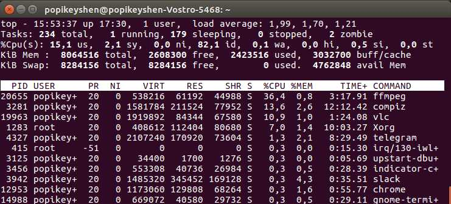

# Streaming opencv image with ffmpeg

In this repository i will show and code example of ffmpeg streaming an OpneCV image and difference between ffmpeg pipeline with banchmarks.

## How to use ffmpeg

[ffmpeg](https://www.ffmpeg.org/) - is an complete, cross-platform solution to record, convert and stream audio and video. He exist a very long time and includes many algorithms, so I will be not surprised if you use it in your pipelines.

### 1. ffmpeg streaming directly
First example is an streaming example directly from video device **/dev/video0** (in this example it is my notebook webcam but it can be your videofile)

```
ffmpeg -f video4linux2 -i /dev/video0 -f rtp_mpegts  rtp://127.0.0.1:1234
```
You can test the stream with ffplay or VLC
1. ffplay rtp://127.0.0.1:1234
2. VLC (media->network stream)

 
And this is how the streaming process look like

          _____________              ______________
         |             |            |              |
         |Video device |  demuxer   | encoded data |   decoder
         | /dev/video0 | ---------> | packets      | -----+
         |_____________|            |______________|      |
                                                          v
                                                      _________
                                                     |         |
                                                     | decoded |
                                                     | frames  |
                                                     |_________|
                ________             ______________       |
               |        |           |              |      |
               | output | <-------- | encoded data | <----+
               | file   |   muxer   | packets      |   encoder
               |________|           |______________|

This is tested on my notebook with **7th Gen CORE i5** but wee need use this with an OpenCV

### 2. ffmpeg streaming from OpenCV

	[ffmpeg](https://www.ffmpeg.org/) is a big good solutions but in some cases we need maximum optimization.

## How to compile and install ffmpeg
